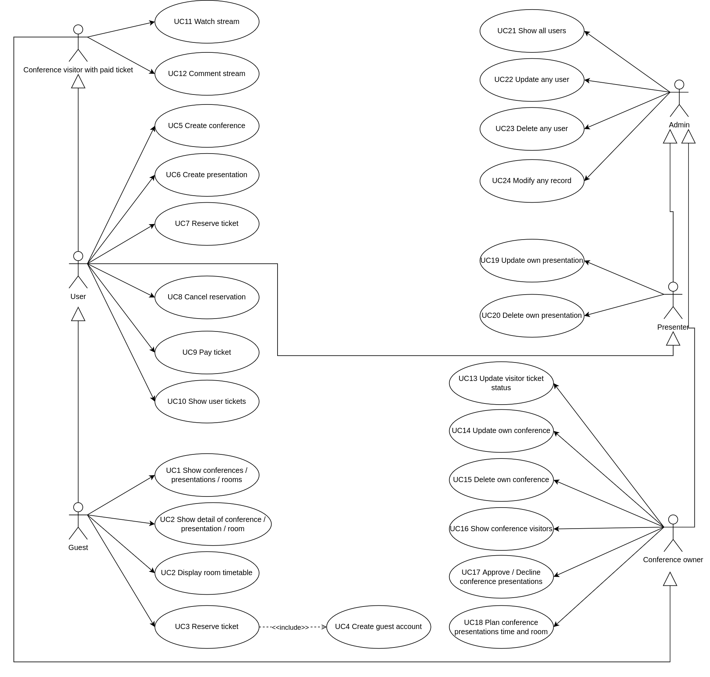
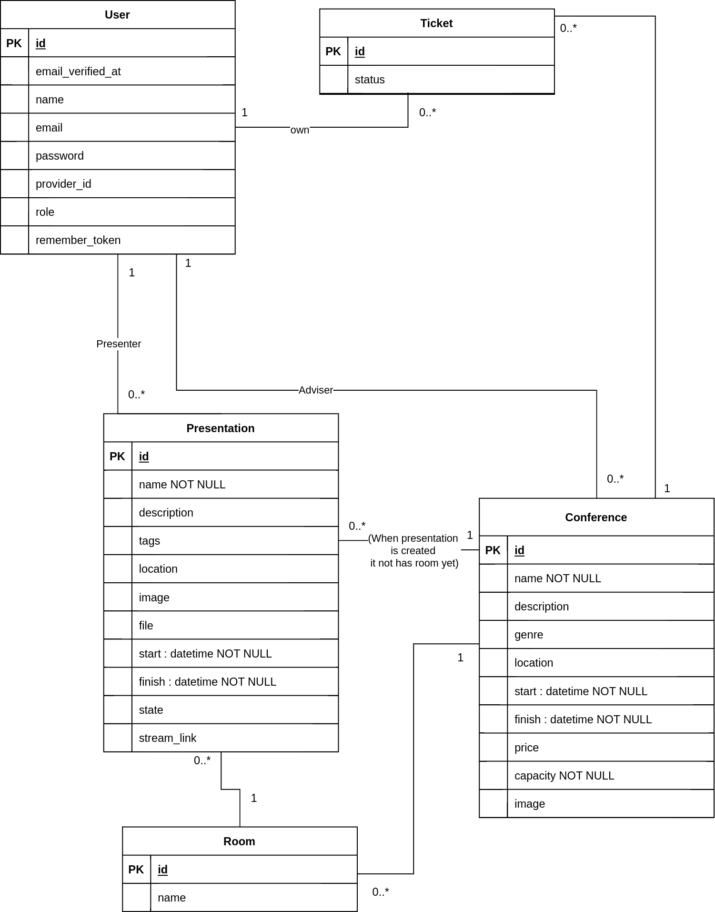
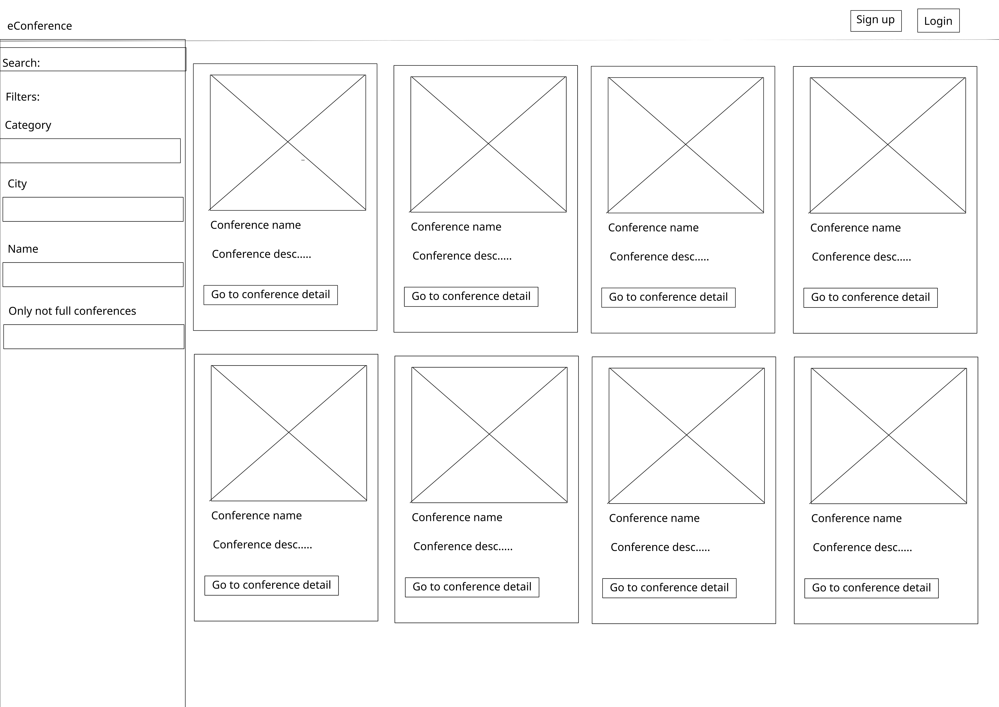
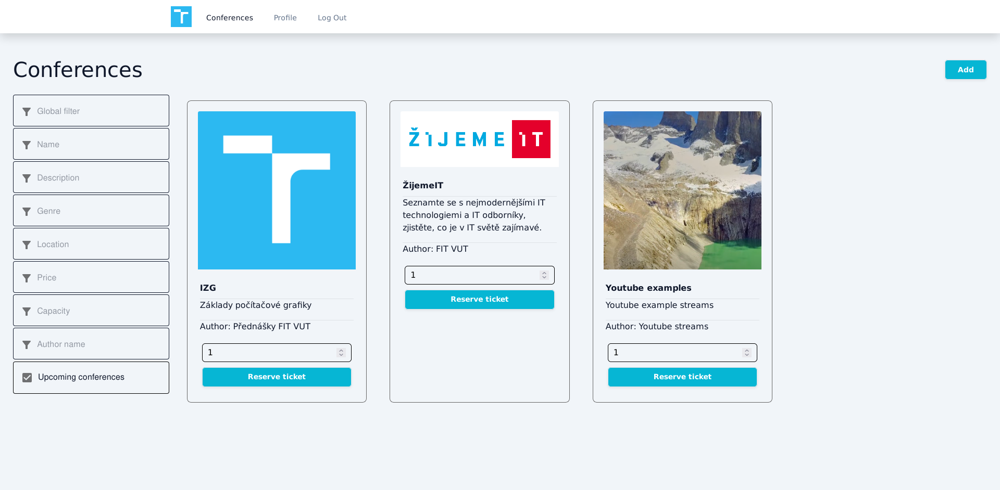
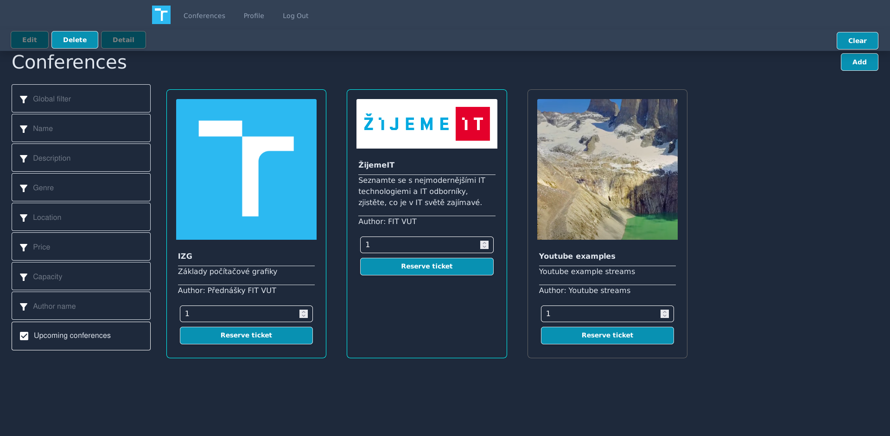
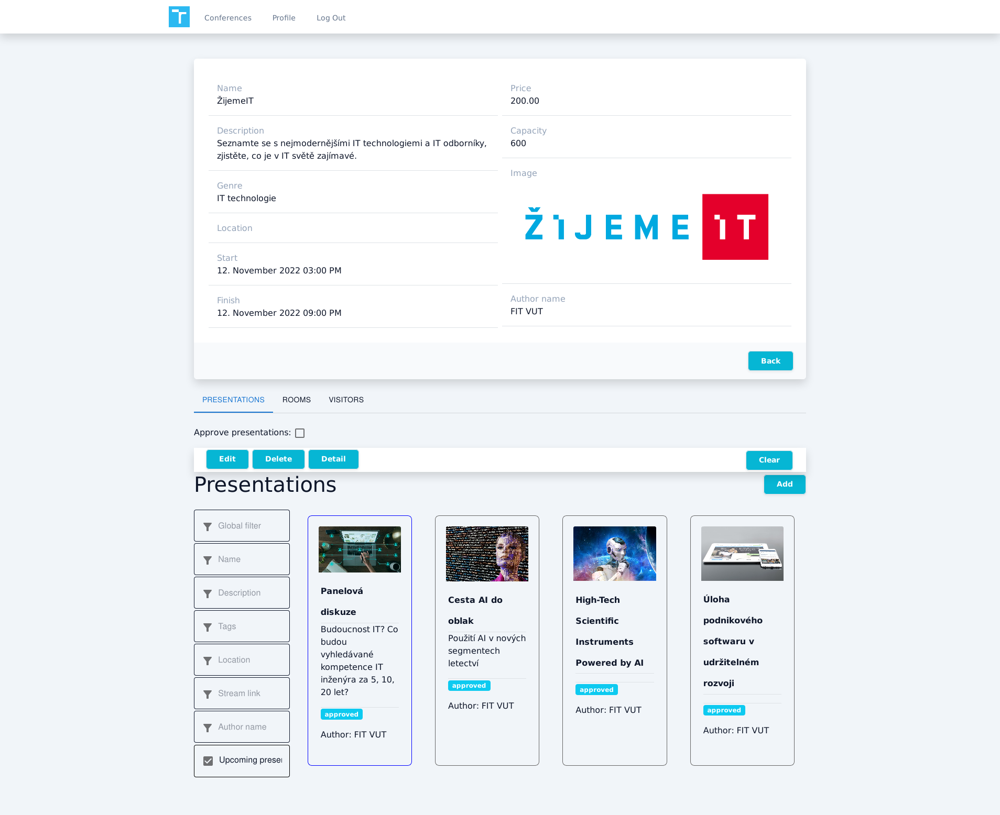
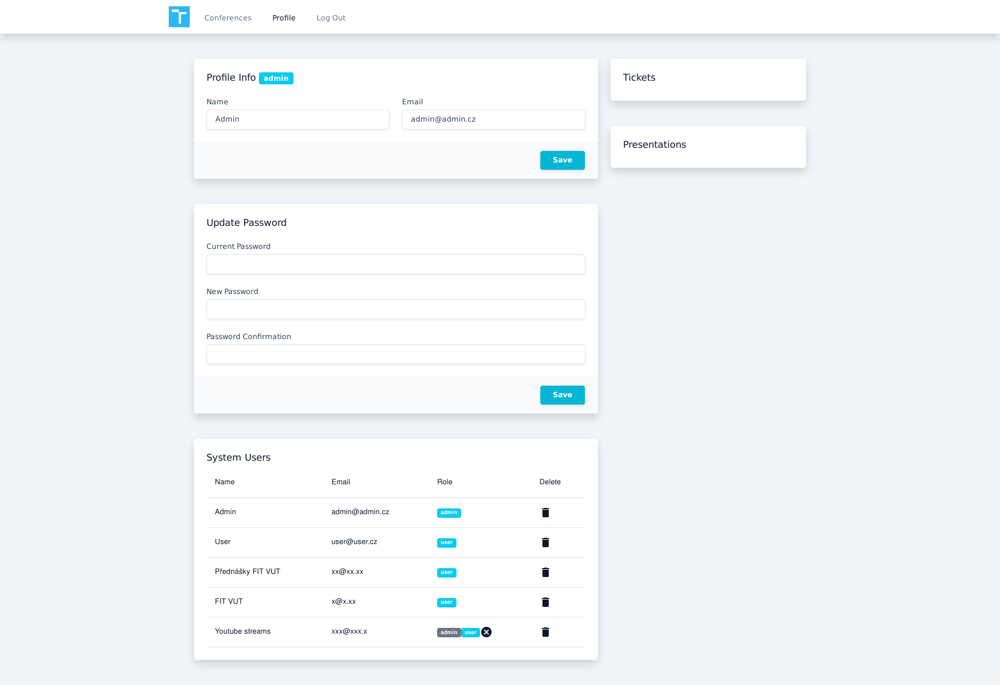
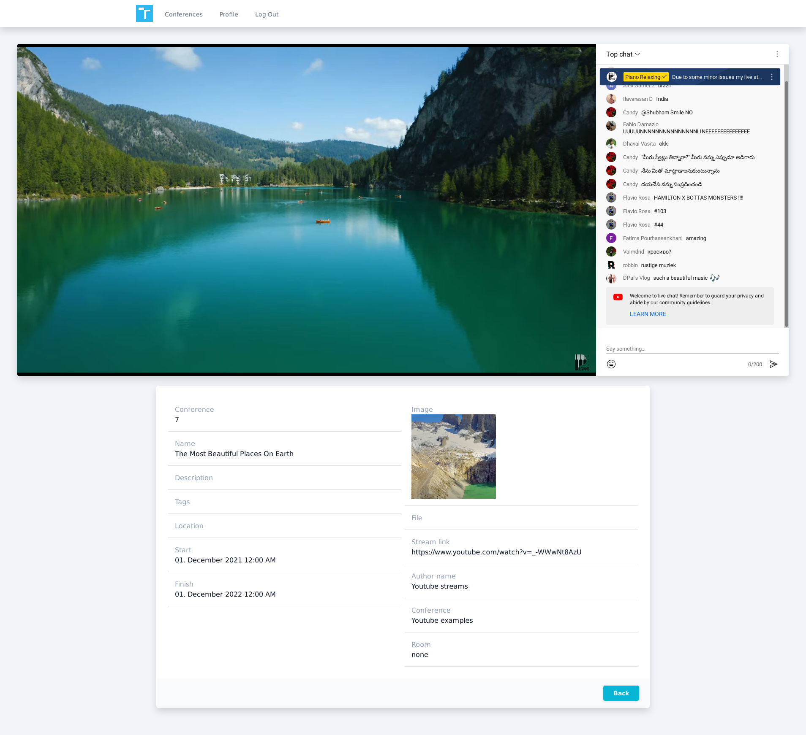

# Conferences-system
Conference system. Within the system it was possible to create conferences, register for conferences and stream lectures including ticket sales. Implemented in the Information Systems and User Interface Design courses in the BUT FIT Bachelor's programme. Implemented using React.JS and Laravel.

## Design

### Use case

### ER Diagram

### Wireframe

## Result

### Landing page
Our application support light and dark theme

### Detail view to conference from owner
Owner can approve or decline presentations.

### Admin profile page

### Conference stream
